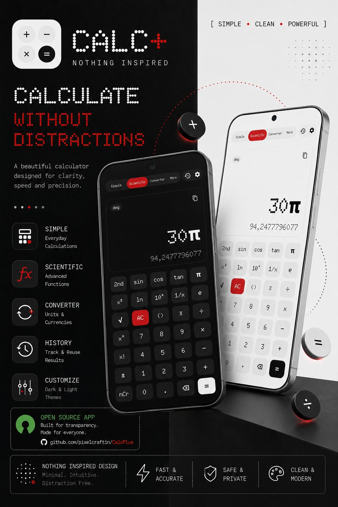
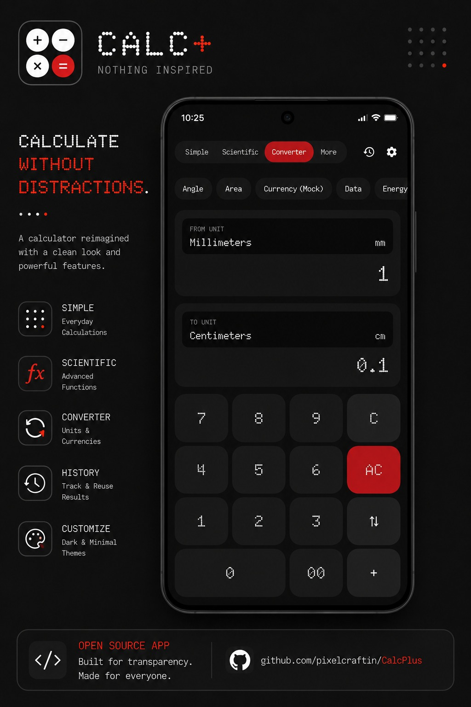
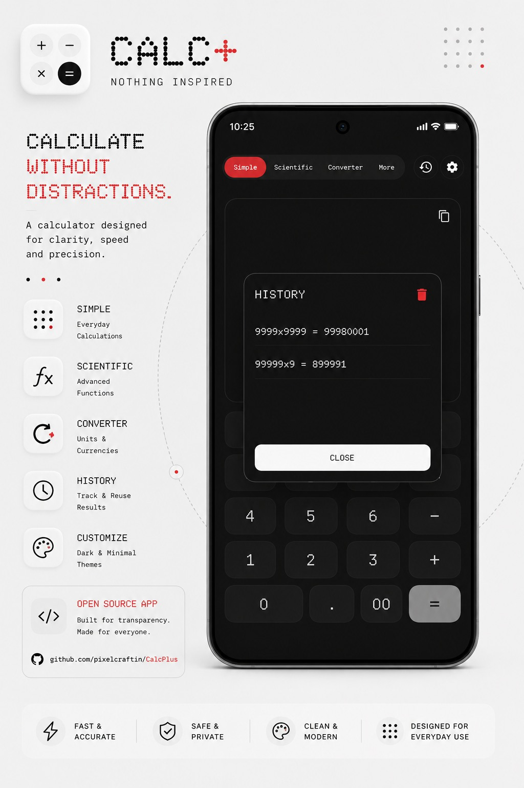

# Calc+

**Calc+** is a lightweight, responsive, open-source mobile calculator application built in Kotlin using Jetpack Compose. Its design is heavily **inspired** by the minimalist, industrial dot-matrix design language of **Nothing OS**.

---

## Preview

---

### Features

1. **Simple Mode:**
 
2. **Scientific Mode:**

3. **Unit Converter Mode:**

4. **More Mode (Utilities):**

5. **Appearance Customization:**
   - Theme Selection: *System default, Light mode, Dark (OLED black) mode.*
   - Keypad Button Shape: Toggle buttons between *Rounded Rectangle* tiles and *Circle* keys.
   - Font Style: Swap between *Dot Matrix (Doto Font)* and *System Font*.

6. **Legal & Transparency:**
   - In-app credits acknowledging design influences and open-source typography creators.
   - Complete legal licensing screens displaying full GPL v3.0 guidelines and third-party licenses.

---

### Open-Source Contributions & Guidelines

We welcome open-source contributions to **Calc Plus**!
- If you find a bug or have a suggestion, please open a GitHub Issue.
- To submit code changes, fork the repository, make your changes on a feature branch, and submit a Pull Request.
- **Licensing Constraint:** All additions or changes must adhere to the GNU GPL v3.0 guidelines. No proprietary or closed-source code is permitted.

---
*Created by [pixelcraftin](https://github.com/pixelcraftin)*
