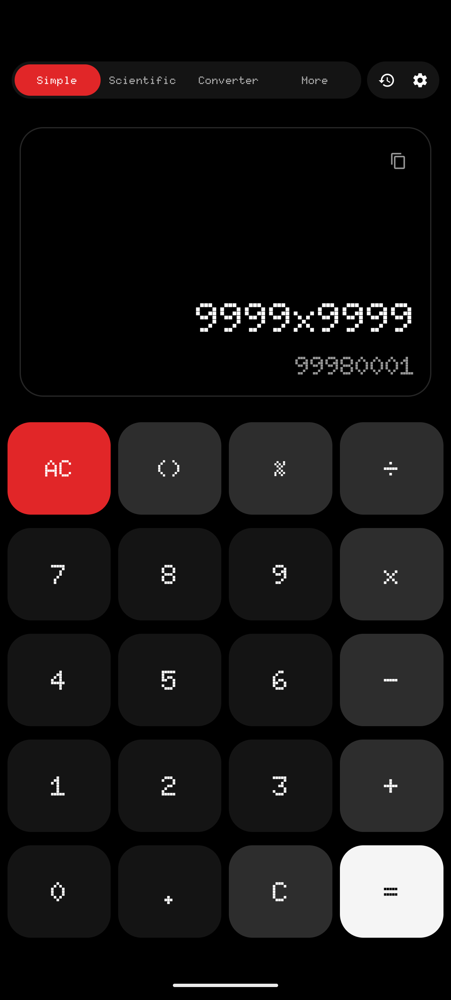
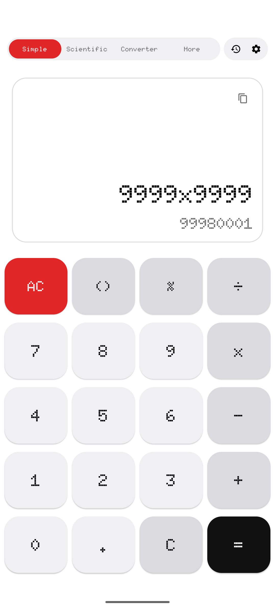
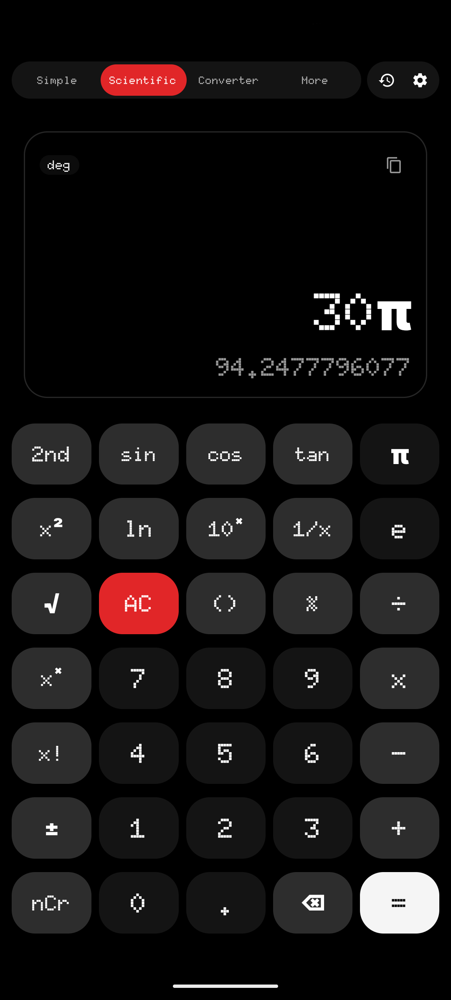
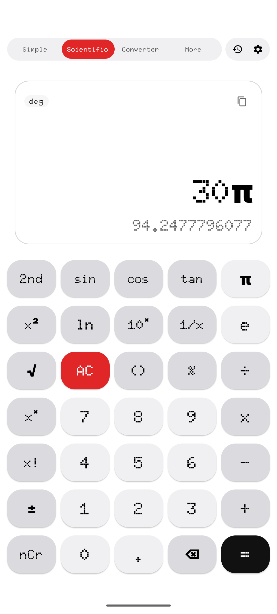
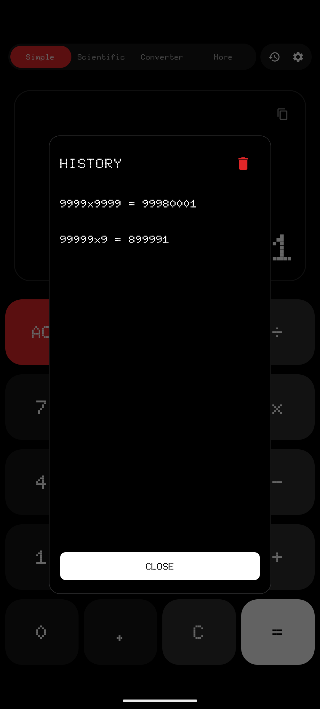
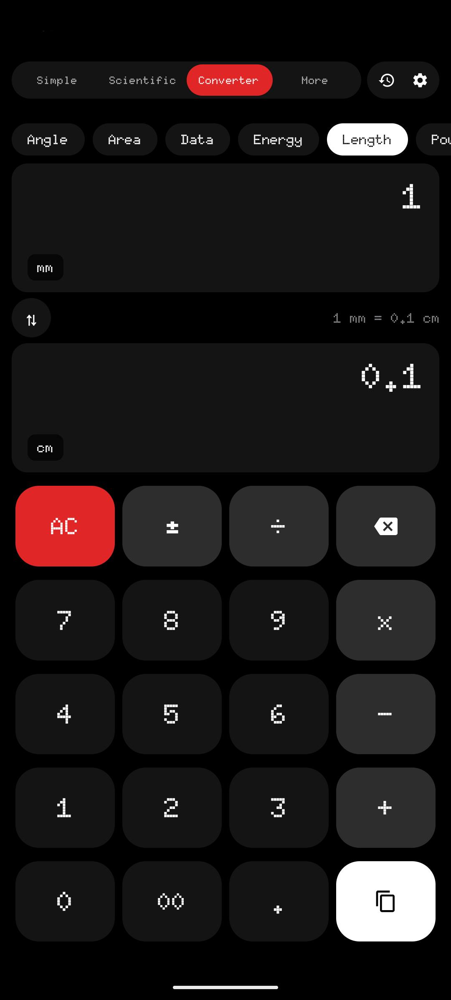

# Calc+

**Calc+** is a lightweight, responsive, open-source mobile calculator application built in Kotlin using Jetpack Compose. Its design is heavily **inspired** by the minimalist, industrial dot-matrix design language of **Nothing OS**.

---

## Preview

<table>
  <tr>
    <td></td>
    <td></td>
    <td></td>
  </tr>
  <tr>
    <td></td>
    <td></td>
    <td></td>
  </tr>
</table>

---

### Features

1. **Simple Mode:**
   - Standard math operators: `+`, `-`, `×`, `÷`, `%`.
   - Real-time expression rendering (sub-result preview as you type).
   - Dynamic auto-scaling typography to prevent expression clipping.
   - Interactive, smart brackets `()` engine.

2. **Scientific Mode:**
   - Expanded keyboard layout.
   - Trigonometric functions (`sin`, `cos`, `tan`) supporting live `DEG` / `RAD` angle mode switching.
   - Logarithms (`ln`, `log`), roots (`√`), powers (`^`, `x²`), factorials (`x!`), and constants (`π`, `e`).

3. **Unit Converter Mode:**
   - Multi-category offline conversion engine supporting 13 distinct categories:
     - *Angle, Area, Currency, Data, Energy, Length, Power, Pressure, Speed, Temperature, Time, Volume, Weight.*
   - Dual-card value displays with scrollable popup selection dialogs.
   - Soft numeric keyboard with unit swap button (`⇅`) for fast offline operations.

4. **More Mode (Utilities):**
   - **EMI Calculator:** Loan Principal, annual Interest, and Tenure (months) with interest breakdown card.
   - **Bill Splitter:** Bill amount, tip percentage, and party size with clean per-person splits.
   - **BMI Calculator:** Metric Height & Weight entries with a color-coded classification indicator bar.

5. **Appearance Customization:**
   - Theme Selection: *System default, Light mode, Dark (OLED black) mode.*
   - Keypad Button Shape: Toggle buttons between *Rounded Rectangle* tiles and *Circle* keys.
   - Font Style: Swap between *Dot Matrix (Doto Font)* and *System Font*.

6. **Legal & Transparency:**
   - In-app credits acknowledging design influences and open-source typography creators.
   - Complete legal licensing screens displaying full GPL v3.0 guidelines and third-party licenses.

---

### Open-Source Contributions & Guidelines

We welcome open-source contributions to **Calc Plus**!
- If you find a bug or have a suggestion, please open a GitHub Issue.
- To submit code changes, fork the repository, make your changes on a feature branch, and submit a Pull Request.
- **Licensing Constraint:** All additions or changes must adhere to the GNU GPL v3.0 guidelines. No proprietary or closed-source code is permitted.

---
*Created by [pixelcraftin](https://github.com/pixelcraftin)*
